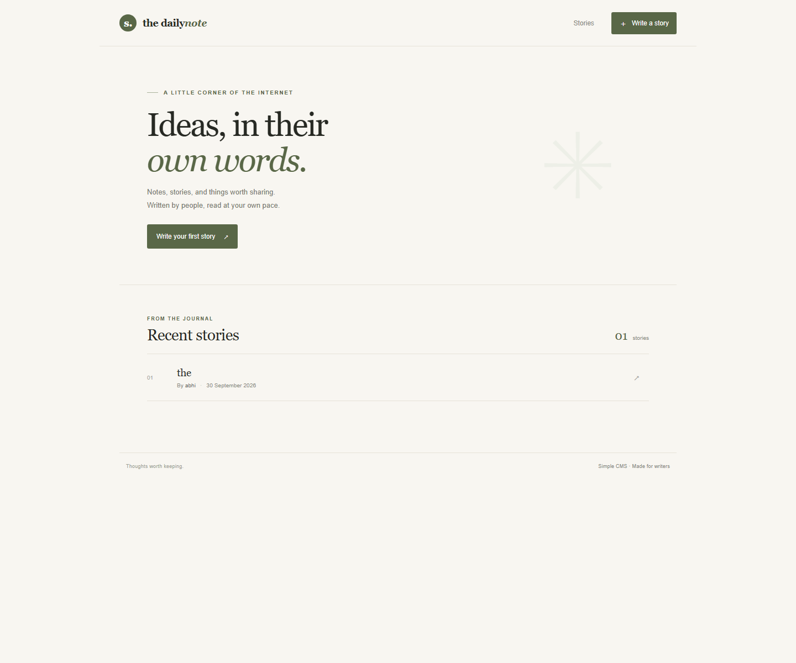
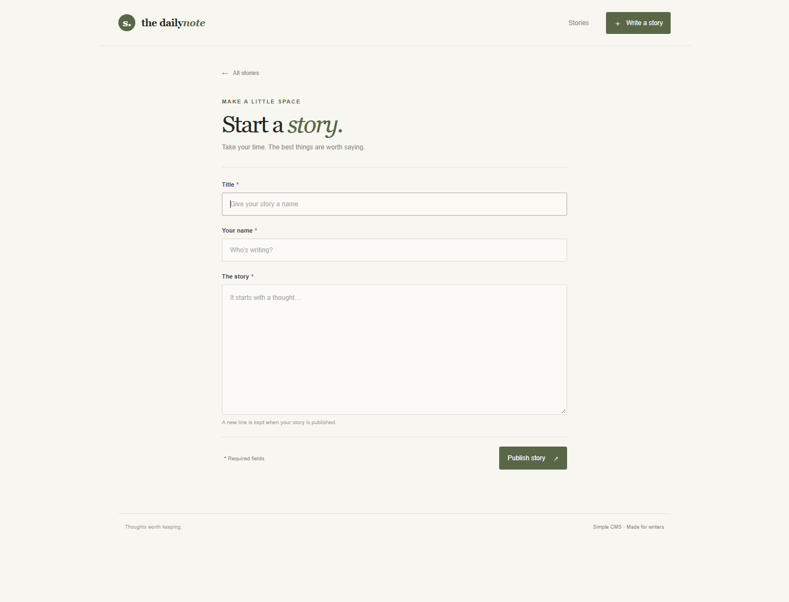
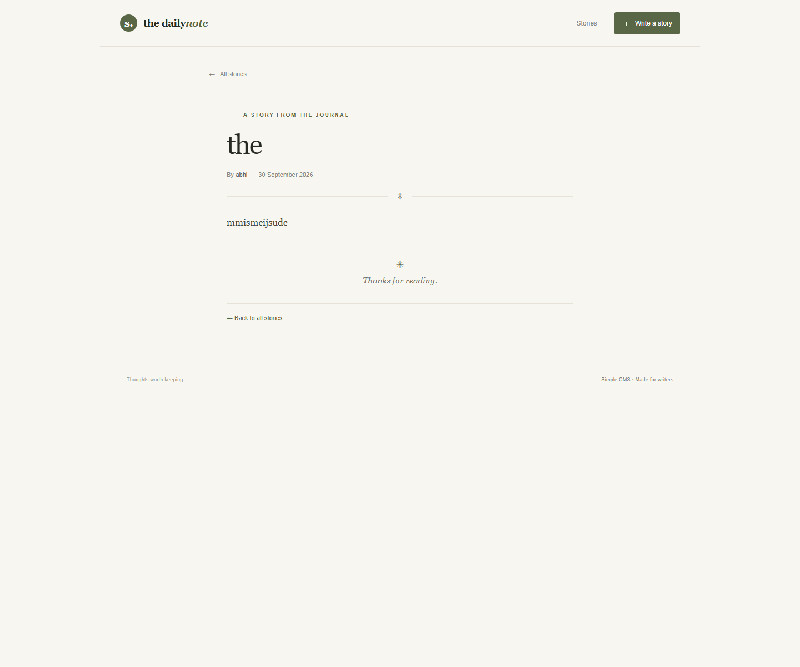

# Simple CMS

A small server-rendered blog application built with Flask, Jinja2, and MongoDB. Posts are stored in the `cms_lab.posts` collection; the list page only retrieves summary fields, while each story page loads its full content by MongoDB `_id`.

## Screenshots

### Post list



### Create a post



### Individual post



## Requirements

- Python 3.10 or newer
- MongoDB running at `mongodb://127.0.0.1:27017`

If the app reports that MongoDB is unavailable, the Python packages are installed but the MongoDB **server** is not running at that address. In PowerShell, check for a Windows service with `Get-Service *Mongo*`. If a MongoDB service is listed, start it with `Start-Service MongoDB` (run PowerShell as Administrator if Windows requests it). If no service is listed, install MongoDB Community Server and start its Windows service; MongoDB Compass by itself is only a database client. Then refresh the app.

## Run locally

```powershell
$pythonExe = "$env:LOCALAPPDATA\Programs\Python\Python313\python.exe"
& $pythonExe -m venv .venv
.venv\Scripts\Activate.ps1
& .\.venv\Scripts\python.exe -m pip install -r requirements.txt
& .\.venv\Scripts\python.exe app.py
```

If you already installed Flask and PyMongo into your regular Python instead of a virtual environment, start the app with:

```powershell
& "$env:LOCALAPPDATA\Programs\Python\Python313\python.exe" app.py
```

Open <http://127.0.0.1:5000>. Use **Write a story** to create a post. The backend validates all fields and assigns `createdAt` automatically; MongoDB generates `_id`.

Set `MONGODB_URI` or `MONGODB_DATABASE` to override the connection defaults. Set `SECRET_KEY` to a private value when deploying. For example, in PowerShell:

```powershell
$env:MONGODB_URI = "mongodb://127.0.0.1:27017"
$env:SECRET_KEY = "replace-with-a-random-value"
python app.py
```

## Routes

| Method | Route | Purpose |
|---|---|---|
| GET | `/` or `/posts` | List posts |
| GET | `/posts/new` | Show create form |
| POST | `/posts` | Validate and save a post |
| GET | `/posts/<id>` | Load one complete post by MongoDB `_id` |

The create form deliberately has no date field. Posts persist in MongoDB when the app restarts.
